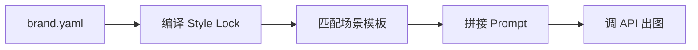

# brand_vision_ecom

把品牌视觉规则写进一个 yaml 文件，电商产品图自动遵守这套规则。

不用每张图都重写一遍 prompt（还经常写错色号、写混字体、每一张风格都不一样）。配一次，之后所有 AI 生图都用同一套颜色、字体、打光、构图规则。

---

## 快速开始

```bash
# 1. 下载
git clone https://github.com/ray-lee-coder/brand_vision_ecom.git
cd brand_vision_ecom

# 2. 装依赖（只需要 pyyaml）
pip install pyyaml

# 3. 配 API（把 .env.example 另存为 .env，填入 key）
#    IMG_BASE_URL=https://token.sensenova.cn/v1
#    IMG_MODEL=sensenova-u1-fast
#    IMG_API_KEY=sk-......

# 4. 出图
python3 scripts/generate_image.py examples/aether/brand.yaml \
  --product "无线耳塞，暗海军蓝色机身，金色装饰环" \
  --template hero-image
```

输出是一张 2048×2048 的 PNG 图片。

---

## 工作方式



1. **brand.yaml** — 品牌颜色、字体、打光偏好写在一个 yaml 文件里
2. **Style Lock** — 脚本把品牌规则编译成一段"视觉合同"（色号、字体名、光线方向、产品占比、留白比例），这段合同插在每张 Prompt 的第一段
3. **场景模板** — 5 个内置模板（白底主图、场景氛围图、细节微距、多角度网格、海报 Banner），每个模板有 3 个风格变体
4. **Prompt** — 把 Style Lock + 模板 + 产品描述拼接成最终 Prompt
5. **API 调用** — 发送到任何 OpenAI 兼容的生图接口，下载结果图片

多张图（同一组 PDP）共用同一段 Style Lock，保证视觉一致。

---

## 对比：直接用 GPT-4o 写 prompt  vs  用这个工具

| 场景 | 直接用 LLM | 用 brand_vision_ecom |
|------|-----------|---------------------|
| 颜色 | 写 "深蓝色" → 出来是藏青还是钴蓝不确定 | hex 值是 `#1E3A8A`，每次都一样 |
| 字体 | 写 "现代无衬线字体" → LLM 随机挑一个 | 写 `Inter` 就是 Inter |
| 风格一致 | 每张图单独描述 → 容易跑偏 | 先锁 Style Lock → 每张图第一段相同 |
| 换品牌 | 从头改 prompt | 换个 brand.yaml 文件就行 |
| 出多张图 | 每张写一次、每张都可能不一样 | --template 换模板名，Style Lock 自动复用 |

---

## brand.yaml 配置

```yaml
brand:
  name: "品牌名称"
  description: "品牌风格一句话（会被嵌入 Prompt）"
  tone: "cool"                      # warm / cool / neutral

  colors:
    primary: "#D4AF37"              # 主色（必填）
    accent: "#D4AF37"               # 强调色（可选，不填=主色）
    canvas: "#FFFFFF"                # 画面背景色（必填）
    text: "#F7F5F0"                  # 文字色（必填）
    surface: "#1B2A4A"              # 表面色（可选）
    border: "#9DB3CD"               # 边框色（可选）

  typography:
    display: "PP Mori"               # 展示字体
    body: "Inter"                     # 正文字体

  imagery:                            # 产品摄影偏好（可选，都有默认值）
    primary_lighting: "editorial_cinematic"
    default_angle: "three_quarter"
    product_frame_ratio: 0.40          # 产品占画面比例
    background: "pure_white"
    retouching: "moderate"
    min_views: 5
    required_angles:
      - front
      - three_quarter_left
      - three_quarter_right
      - side_left
      - detail
```

用你喜欢的品牌调两个字段：`examples/aether/brand.yaml`（音频科技）和 `examples/nike/brand.yaml`（运动），参考它们的写法。

---

## 场景模板（15 个）

| 模板 ID | 适用的图 | 风格变体 |
|---------|---------|---------|
| `hero-image` | 白底主图、商品搜图、首页首图 | luxury / minimal / tech |
| `lifestyle-scene` | 场景氛围图、使用场景 | indoor / outdoor / studio |
| `flat-lay` | 平铺图、俯拍、配饰摆拍 | minimal / styled / bundle |
| `detail-macro` | 细节图、材质特写、工艺展示 | material / stitching / hardware |
| `model-showcase` | 模特展示、服装穿搭 | fullbody / halfbody / detail / editorial |
| `social-media` | 小红书/Instagram/抖音图 | xiaohongshu / instagram / tiktok |
| `ugc-style` | 买家秀、开箱、真实用户图 | unboxing / using_selfie / review |
| `before-after` | 前后对比、效果展示 | skincare / cleaner / lighting |
| `packaging` | 包装展示、礼盒、开盒 | closed / opened / gift |
| `infographic` | 信息图、详情页 A+ 模块 | feature_grid / comparison / specs |
| `multi-product` | 套装、组合、系列陈列 | row / cluster / tiered |
| `multi-angle-grid` | 多角度、颜色对比 | 2x2 / 1x4 / colors |
| `magazine-editorial` | 杂志风、品牌形象大片 | high_fashion / still_life / cover |
| `seasonal-campaign` | 季节/节日/Campaign | spring / summer / autumn / winter |
| `poster-banner` | 促销海报、新品发布 | sale / editorial / launch |

```bash
# 换成不同模板就行
python3 scripts/generate_image.py examples/aether/brand.yaml \
  --product "..." --template lifestyle-scene

# 加 --variant 指定风格变体
python3 scripts/generate_image.py examples/aether/brand.yaml \
  --product "..." --template poster-banner --variant editorial
```

---

## 项目文件

```
├── scripts/generate_image.py     核心，257 行
├── templates/                     5 个场景模板（JSON）
├── schemas/brand.schema.json      brand.yaml 的规范
├── examples/
│   ├── aether/brand.yaml          示例品牌（音频科技，暖金+海军蓝）
│   └── nike/brand.yaml            示例品牌（运动，黑白单色）
├── .env.example                   API 配置模板
└── README.md
```

零外部 Git 依赖。装好 `pyyaml`、配好 API key，就能出图。

---

## 支持的 API

任何 OpenAI 兼容的生图接口。在 `.env` 里配：

```ini
IMG_BASE_URL=https://token.sensenova.cn/v1
IMG_MODEL=sensenova-u1-fast
IMG_API_KEY=sk-......
```

测试过的后端：SenseNova U1-Fast、GPT-Image-2（apimart.ai）。理论上任何 `v1/images/generations` 接口都兼容。
